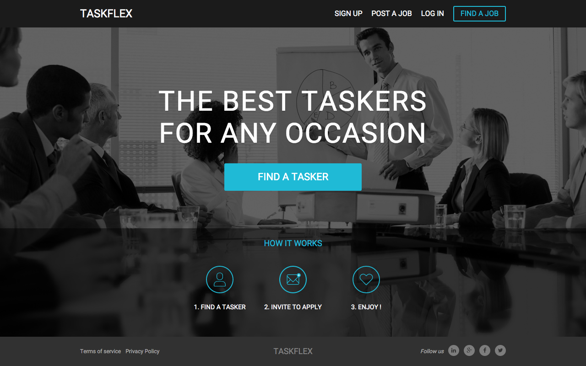
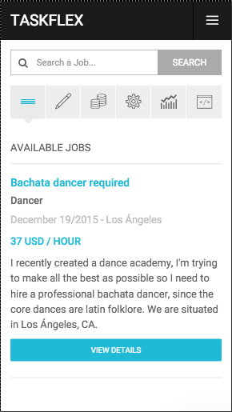

# TaskFlex

> *The best taskers for any occasion.*

## [Live Demo]

Here is a couple of pictures and [Live Demo] so that you can see at first look
what are you going to find in this project.

</img>
</img>
</img>

The live demo contains some default users and jobs, but you can create your own users and/or jobs.
Just take into account that everyday from 05:00 to 06:00 UTC all the data will be deleted and
again the default users and jobs will appear as seed data.

---

Following, you will find an introduction about TaskFlex and information about
how to deploy and use the project in your own environment.

## Fast usage with [Docker]

**Waring:** The following script may take many minutes. Using 30 Mbps ethernet
connection it took around 45 minutes.

```bash
bash -c "$(curl -s https://raw.githubusercontent.com/talosdigital/TaskFlex/master/raw/init.sh)"
```

The above *all-in-one* [bash] script will do the hard work for you. It will
be perfect if you only want to see TaskFlex running and working alongside [TDJobs]
and [TDUser], and play with them.

The only things you need to have are (notice starred items before installing):
- [Docker]\* installed.
- [Compose]\* installed.
- git installed.

> If you are in Mac OS:
- [Docker Machine]\* installed.
- A created and optionally started virtual machine using Docker Machine.

\* Recommended to install with [Docker Toolbox].

---

The above command will, in respective order:
  1. Create a working directory.
  2. Check installation of required programs.
  3. Clone TaskFlex, [TDJobs] and [TDUser] repositories.
  4. Download a *docker-compose* file with link, build and execute instructions
     for Docker. (*Don't worry, it is all automatic*).
  5. Download and build required images and containers.
  6. Serve and link built containers.
  7. Execute required migrations in databases.

The following, is a basic diagram showing how containers are linked.

</img>

**Image 1:** Containers distribution and linking for TaskFlex, TDJobs and TDUser

## Table of contents

* [Prelude](#prelude)
   * [What is TaskFlex?](#what-is-taskflex-)
   * [Architecture](#architecture)
* [Try it yourself](#try-it-yourself)
  * [Dependencies](#dependencies)
  * [Download](#download)
  * [Setup](#setup)
    * [Front end](#front-end)
    * [Back end](#back-end)
  * [Start](#start)
    * [Start Redis server](#start-redis-server)
    * [Start Sidekiq](#start-sidekiq)
    * [Start TaskFlex](#start-taskflex)
  * [Deploying with Docker](#deploying-with-docker)
* [Contributing](#contributing)

## Prelude

### What is TaskFlex ?

TaskFlex is an **example** application to showcase how the TDJobs service can be
used. In this case, TaskFlex takes the TDJobs' job marketplace logic to build a
complete application that allows **owners** to post jobs related to any kind of
service, and **taskers** to apply or being invited to a particular job.

### Architecture

TaskFlex has two main components, we have got a [front end] built in AngularJS
and a [back end] developed in Ruby on Rails. TaskFlex’s back end is an **API**
which uses 2 other services: [TDUser] and [TDJobs], which handle user/ accounts
logic, and the job marketplace logic, respectively.

In order to clarify the above description, take a look at the following diagram:

</img>

**Image 2:** TaskFlex's basic architecture

You may be wondering what is *Wrapper gems*. Well, they are simple Ruby gems
that make an abstraction of HTTP communication between our TaskFlex back end
and both TDJobs and TDUser services, through models and methods, making easier
the usage of the mentioned services. Take a look at them in the following links:

- [TDJobsGem](https://github.com/talosdigital/TDJobsGem)
- [TDUserGem](https://github.com/talosdigital/TDUserGem)

## Try it yourself

Coming up, you will find a detailed guide so that you can try out the project
in your own environment.
> **Note:** As you just realize, TaskFlex mainly depends on other **two**
projects, we will provide information about how to check out their guides so
that you can set up all dependencies before running TaskFlex.

### Dependencies

TaskFlex has the following dependencies by the front end side:

> The following two dependencies are recommended to be installed using [Node
Version Manager (NVM)]
> - [Node.js] - 4.1.1
> - Node Package Manager (npm) - 2.14.4 *(comes with node now)*

- [Bower] - 1.4.1
- [Gulp] - 3.9.0

Dependencies by the back end side are the following:

> The following two dependencies are recommended to be installed using [Ruby
Version Manager (RVM)]
> - [Ruby] - 2.0.0+
> - [Rails] - 4.2.3+

- [Redis] - 3.0.5
- [TDJobs] - 1.0.0
- [TDUser] - 1.0.0

### Download
In order to run get the project, you can directly download and extract the
[`.zip`](https://github.com/talosdigital/TaskFlex/archive/master.zip)
package,

or clone it using git:
```bash
$ git clone https://github.com/talosdigital/TaskFlex.git
```

Once you have downloaded the project, you will find the following structure:
```
TaskFlex/
├── frontend/
│   ├── app/
│   └── spec/
└── backend/
    ├── app/
    ├── bin/
    ├── config/
    ├── lib/
    └── spec/
```

As you may already noticed, in the `frontend` folder you can find the AngularJS
application, and in the `backend` folder you can find the Ruby on Rails
application, they are the components described in the
[Architecture section](#architecture).

### Setup

First, the description about how to setup the front end component is being
covered, because it is faster than the back end one.

#### Front end

##### Step into the `frontend` directory
Open a system terminal and step into the `frontend` folder with the following
command:
```bash
$ cd frontend/
```
There you will find multiple files, including `package.json` and `bower.json`.

##### Install node dependencies
Start installing all the project dependencies, for that purpose you should run:
```bash
$ npm install
```
npm will dowload and install required dependencies stated in the
`package.json` file.

##### Install bower dependencies
Then, install all the remaining dependencies, in this case we use bower, as
follows:
```bash
$ bower install
```

bower will download and install required dependencies stated in the `bower.json`
file, such as AngularJS and other utilities.

##### Configure API location
If you need to personalize the API (*TaskFlex back end*) location, please
modify the `app/main.js` file, where you'll find `host`, `protocol` and `port`
in the `TF_API` constant.
Each `undefined` value will take the same value as TaskFlex's front end URI.
> **Note:** The default configured back end port is 81, which is the used by
`docker-compose`.

##### Configure variables
TaskFlex will run in port 8000 by default, but if you want a different port,
just export the `TASKFLEX_FRONT_END_PORT` environment variable with the desired
port, for example: `$ export TASKFLEX_FRONT_END_PORT=80`.

---
After installing all dependencies and setting up environments, the front end
component is ready to be served.

#### Back end

Please take into account that in this section we are describing how to setup the
TaskFlex back end **without** using [Docker]. If you want to use Docker instead
please check the [Deploying with Docker section](#deploying-with-docker).

##### Step into the `backend` directory
Open a new terminal tab and step into the `backend` directory, using the
following command.
```bash
$ cd backend/
```
> **Note:** Previous command assuming you are in the project's root directory,
i.e. `TaskFlex/`.

##### Setup environment variables

Many of the following configuration steps use environment
variables, notice that **`config/environment.rb`** file loads another file
called **`environment_variables.rb`** which is automatically created (through an initializer)
according to the information provided in the **`config/env_vars.json`** file. If you open it you'll
find some *dummy* configuration which **won't work**. You should modify the `.json` file
according to your configuration.

##### Install application dependencies
You need to make sure all dependencies are available for the application, in
order to do that you should run:
```bash
$ bundle
```
In case the previous command did not work for you, try running:
```bash
$ ./bin/bundle
```

In that way, the bundler will download (if required) and install dependencies
stated in the `Gemfile`.

##### Configure TDJobs
> Assuming you already followed the given steps in [TDJobs] README and have a
running instance of it, now it is time to configure our TaskFlex back end to
consume that running service.

With your favourite editor, open the `td_jobs_config.rb` file which is located
in `app/config/initializers/` directory. There you will find two configurations:
`application_secret` and `base_url`. Setup those configuration variables
accordingly to your running TDJobs instance.

* `application_secret` is defined by TDJobs configuration, every request made by
TaskFlex will contain a header with this secret, telling that it is an
authorized application.
* `base_url` is the URL, port and base path where your TDJobs is running, an
example value for this variable is: `http://localhost:3000/api/v1`.

> *Default production values are loaded from environment configuration*

##### Configure TDUser
> Assuming that you already followed the given steps in [TDUser] README and
have a running instance of it, now it is time to configure our TaskFlex back
end to consume that running service.

With your favourite editor, open the `td_users_config.rb` file which is located
in `app/config/initializers/` directory. There you will find the following
configurations, which you should setup accordingly to your running TDUser
intance:

* `application_secret` is defined by TDUser configuration, every request made
by TaskFlex will contain a header with this secret, telling that it is an
authorized application.
* `base_url` is the URL and port where your TDUser is running, an example value
for this variable is: `http://localhost:9001`.
* `user_url` is the base path where the *user* module defined by TDUser is
located. This variable is `/api/v1/user/` by default.
* `auth_url` is the base path where the *auth* module defined by TDUser is
located. This variable is `/api/v1/auth/` by default.

> *Default production values are loaded from environment configuration*

##### Configure TaskFlex
Now, you should configure TaskFlex itself. The main information that needs to be
configured is the `email_options`, which refers to important variables for the
email service.

Open with your favourite editor the `task_flex_config.rb` file, which is located
in `app/config/intializers/` directory, there you will find the following
configurable variables:

* `categories`  is the information about categories that will appear in the
TaskFlex website, each item will contain a `name`, `keyword` and `image`.
* `items_per_page` indicates how many items should be returned by default when
a paginated search is made.
* `email_options` contains information about email service credentials, base
URL for `` and `href`-containing tags, etc.

Additionally, TaskFlex back end will run by default in port 3001, if you want
to change it, you can either set the `TASKFLEX_BACK_END_PORT` environment
variable with the desired port or go to `puma.rb` file, which is located in
`config/` directory, and edit the default port.

#####  Configure Sidekiq
> *If you installed Redis with all default configurations you probably won't
have to change something at this point.*

If you made modifications or have special setup in your Redis server, please
configure the required environment variables in `sidekiq_config.rb` file,
located in `app/config/initializers` directory.

---
Once all previous setup is done, your own TaskFlex server is ready to be
started.

### Start

In order to start both TaskFlex components you will need to follow next
instructions:

#### Start Redis server
The Redis server should be running, so it can listen at some specific port for
[Sidekiq] email-related requests.

If you installed correctly Redis, running the following command should be enough
to start it:
```bash
$ redis-server
```
If all goes right, you will see a message saying that Redis is now ready to
accept connections on some specific port.

#### Start [Sidekiq]
TaskFlex uses Sidekiq in order to handle background emails, that is, the mailer
service queues an email when it has to send it, and Sidekiq will do the job.

Sidekiq uses Redis to handle all job information.

Start the Sidekiq daemon using:
```bash
$ bundle exec sidekiq
```

#### Start TaskFlex
Now, finally, it is time to start TaskFlex, and again, we need two start our two
components.

##### Start back end
Step into the `backend/` folder and execute:

```bash
$ bundle exec puma
```

You'll see Puma's output indicating the port the server is running on, as well
as the amount of workers it's running.

##### Start front end
While stepping into the `frontend/` directory, you can use gulp or node to serve
the front end. So, execute either:

```bash
$ gulp
```

or

```bash
$ gulp less
$ node app.js
```

> Check the `app.js` file for more details.

---

If all gone right, you can open a browser in the configured host and port and
you'll see the TaskFlex's main page.

### Deploying with [Docker]

There is a ready-to-go `Dockerfile` and a `docker-compose.yml` which makes it
easier to link the TaskFlex, Sidekiq and Redis containers *(back end)*.

To start TaskFlex with Docker, make sure you have installed [Docker] and
[Compose]. The best way to install them both is by installing the
[Docker Toolbox] if you're on OS X or Windows.

**IF YOU'RE NOT ON LINUX:** Make sure you have a virtual machine (VM) to use
Docker. You can create one with docker-machine:

```bash
# we'll call it dev, but you can call it whatever! :)
$ docker-machine create -d virtualbox dev
# Start the VM we just created
$ docker-machine start dev
# Set up the necessary env. variables for docker to be able to talk to the VM:
$ eval "$(docker-machine env dev)"
```

Then, inside TaskFlex back end folder, run:

```bash
$ docker-compose build
$ docker-compose up
```

to build the image and run the container. If you're on Linux, go to
`http://localhost:81` *(check that the port configured in `Dockerfile` file as
`TASKFLEX_BACK_END_PORT` environment variable is 3001. However, a mapping
defined in `docker-compose.yml` will use the port 81)*, where the connection
should be made successfully.

On Mac OS X or Windows, run:

```bash
$ docker-machine ip dev
```

take the output IP and replace `localhost` with it in the above URL.

## Contributing

See [CONTRIBUTING](CONTRIBUTING.md) for details.


[Live Demo]:http://taskflex.talosdigital.com
[Docker]:https://www.docker.com/
[bash]:https://www.gnu.org/software/bash/
[back end]:backend/
[front end]:frontend/
[TDJobs]:http://github.com/talosdigital/TDJobs
[TDUser]:http://github.com/talosdigital/TDUser
[Node Version Manager (NVM)]:https://github.com/creationix/nvm
[Node.js]:https://nodejs.org/
[Bower]:http://bower.io/
[Gulp]:http://gulpjs.com/
[Ruby Version Manager (RVM)]:https://rvm.io/
[Ruby]:https://www.ruby-lang.org/en/
[Rails]:http://rubyonrails.org/
[Redis]:http://redis.io/
[Sidekiq]:https://github.com/mperham/sidekiq
[Compose]:http://docs.docker.com/compose/install/
[Docker Machine]:https://docs.docker.com/machine/install-machine/
[Docker Toolbox]:https://www.docker.com/docker-toolbox
